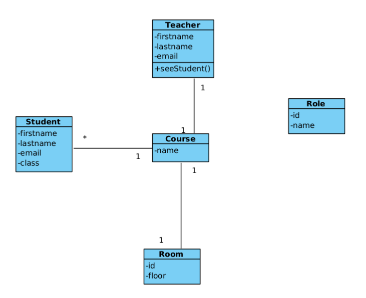
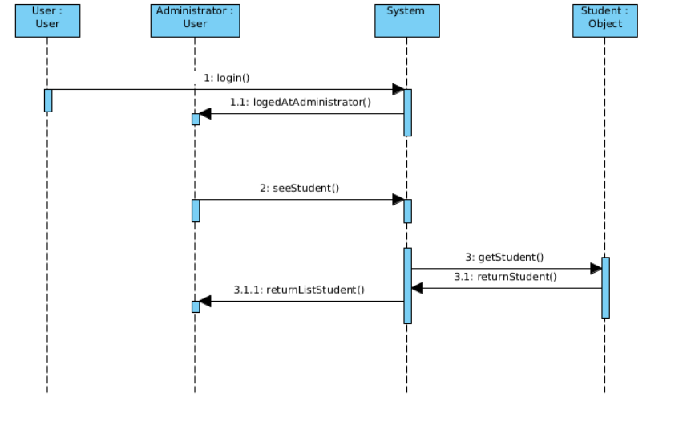
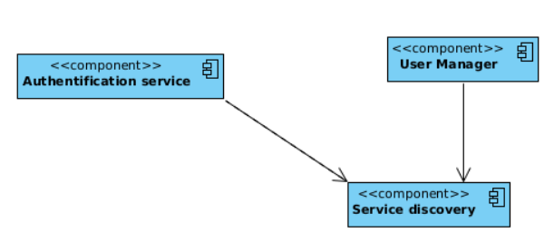

##Course management

### Subject recieved : As an administrator, I want to see student list so that I can see all the information about the students
### Diagrams recieved : 

To see all students, you just have to acces to http://localhost:8080/students. The response will contain information about all students.